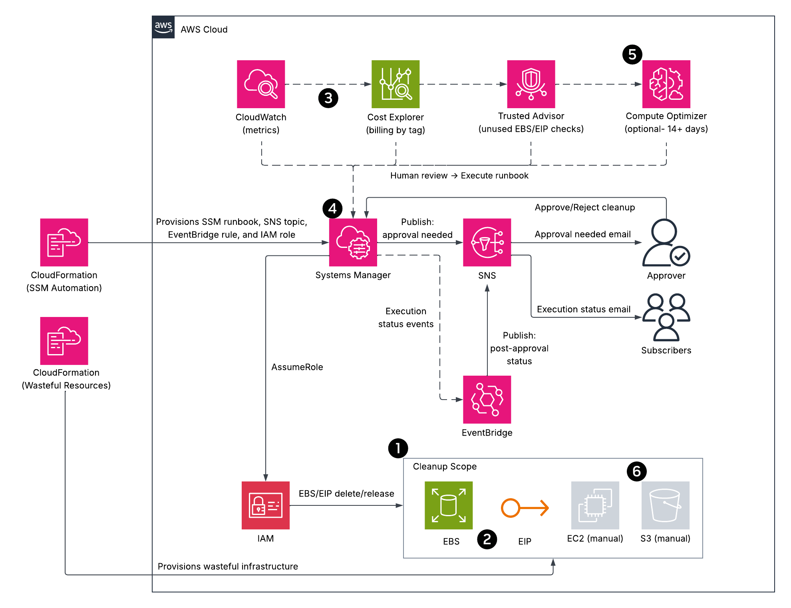
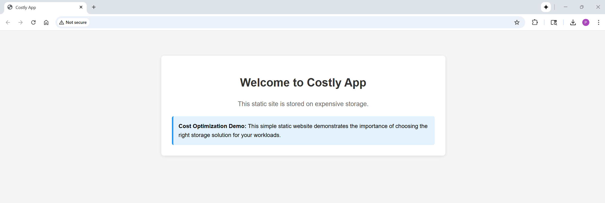
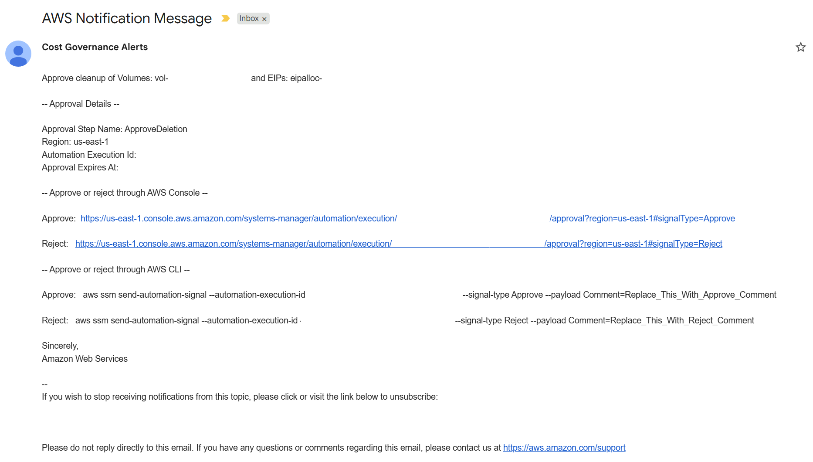
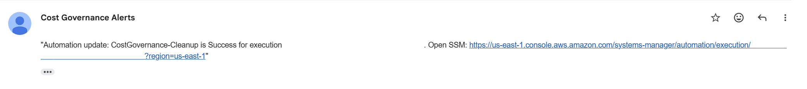

# Automated Cost Governance on AWS (Cost Optimization Pillar)  
A **cost-focused** workflow that intentionally deploys a small set of **wasteful resources** and then uses **governed automation** to eliminate **100% waste** (unattached **EBS** volumes, unassociated **EIPs**) with **human approval** and **least-privilege** IAM. Insights from **CloudWatch**, **Cost Explorer**, and **Trusted Advisor** guide decisions; **Compute Optimizer** is optional for rightsizing after 14+ days. Post-approval status emails are sent via **EventBridge**.  

## Architecture Overview  
  
*Figure 1: Automated Cost Governance - Cost Optimization Focused Architecture*  

### Legend (callouts)  
1. **Tag-driven visibility & control** - Use `Project=CostGovernance` to group spend in **Cost Explorer** and restrict deletions via IAM conditions (e.g., `ec2:ResourceTag/Project`).  
2. **Eliminate 100% waste** - Target **unattached EBS** and **unassociated EIPs** for immediate, zero-risk savings.  
3. **Measure → act → verify** - Baseline with **CloudWatch**, decide, then verify savings later in **Cost Explorer**.  
4. **Governed automation & least-privilege** - **SSM runbook** with `aws:approve` gate; execution role limited to `ec2:Describe*`, `ec2:DeleteVolume` (**tag-scoped to** `Project=CostGovernance`), `ec2:ReleaseAddress`, and `sns:Publish`.  
    - **Approval email path:** `aws:approve` uses `NotificationArn` → **SNS** (topic must start with `Automation-`, e.g., `Automation-CostGovernanceAlerts`).  
    - **Approver access (read-only):** at minimum `ssm:SendAutomationSignal`, `ssm:GetAutomationExecution`, `ssm:DescribeAutomationStepExecutions` (or attach `AmazonSSMReadOnlyAccess`).  
5. **Rightsizing guidance - Compute Optimizer** (optional, 14+ days) for EC2 rightsizing/modernization (e.g., t3.small → t3.micro/Graviton/Spot).  
6. **Data lifecycle** - Add an **S3 lifecycle** rule (30 → Standard-IA, 90 → Glacier) as a manual console step.  

> **Solid** arrows = action/API (automation, provisioning, human approval). **Dashed** arrows = telemetry/insight (metrics, cost, checks, execution events).  
 
## Skills Applied  
- Designing a cost optimization architecture (**tag-driven control, governed automation, human approval**).  
- Implementing least-privilege IAM (**tag-scoped** `ec2:DeleteVolume`, `ec2:ReleaseAddress`, `sns:Publish`, `ec2:Describe*`).  
- Automating cleanup with **SSM Automation (discover → approve → delete EBS / release EIPs)**.  
- Notifying stakeholders via **SNS** (approval-needed) and **EventBridge → SNS** (post-approval status).  
- Measuring with **CloudWatch**, then verifying savings in **Cost Explorer** (group by `Project=CostGovernance`).  
- Rightsizing workloads using **Compute Optimizer** insights *(optional, 14+ days)*.  
- Documenting runbook behavior and **enforcing** separation of duties for the approver vs. execution role.  

## Features (cost optimization focused)  
- **Waste simulation:** optional stack with oversized EC2, unattached EBS, spare EIPs (tagged `Project=CostGovernance`).  
- **Governed cleanup:** runbook discovers **available** EBS volumes and **unassociated** EIPs → **approval** → delete/release.  
- **Least-privilege IAM:** delete volumes only when `Project=CostGovernance` tag is present.  
- **Approver notifications:** `aws:approve` sends **approval-needed** email to SNS subscribers.  
- **Post-approval status:** **EventBridge** emails `Approved | Rejected | Success | Failed | TimedOut`.  

## Tech Stack  
- **Languages:** HTML  
- **AWS Services:** Systems Manager (Automation), SNS, IAM, EC2/EBS/EIP, S3, CloudWatch, Cost Explorer, Trusted Advisor, Compute Optimizer *(optional)*, EventBridge  
- **IaC Tool:** AWS CloudFormation  
- **Other Tools:** AWS CLI  

## Deployment Instructions  
> **Note:** Many commands are identical across shells; the main differences are line continuation (PowerShell: `` ` `` • Bash: `\` • cmd.exe: `^`), environment variables (PowerShell: `$env:NAME=...` • Bash: `NAME=...` • cmd.exe: `set NAME=...`), and path separators.  
  
### CloudFormation  
1. Clone this repository.  

2. *(Optional)* Edit the `params1.json` file to customize the deployment.  
   - `VpcId` is the VPC to deploy the wasteful EC2 instances in.  
   - `SubnetId1` and `SubnetId2` are the subnets within the `VpcId` to deploy the wasteful EC2 instances in.  

3.  *(Optional)* Deploy the wasteful infrastructure.  
	```bash
	cd cloudformation
	aws cloudformation deploy \
	--stack-name costgov-wasteful \
	--template-file wasteful-infrastructure-template.yaml \
	--parameter-overrides file://params1.json \
	--capabilities CAPABILITY_NAMED_IAM
	```

4. *(Optional)* Upload the static website page to the S3 bucket.  
	```bash
	cd ../src
	BUCKET=$(aws cloudformation describe-stacks \
	--stack-name costgov-wasteful \
	--query "Stacks[0].Outputs[?OutputKey=='S3BucketName'].OutputValue" \
	--output text)
	aws s3 cp index.html "s3://$BUCKET/"
	```
	
5. Edit the `params2.json` file to customize the deployment.  
   - `ApproverPrincipal` is the ARN or email of the principal who will approve the wasteful resource cleanup.  
   - `NotificationEmail` is an optional parameter where an email can be entered to subscribe it to the `Automation-CostGovernanceAlerts` SNS topic.  
   - `ProjectTagValue` is the value of the Project tag that is used to scope deletions. The default value is `CostGovernance`.  

6. Deploy the cost governance/resource cleanup automation template.  
    ```bash
	cd cloudformation
	aws cloudformation deploy \
	--stack-name costgov-automation \
	--template-file cost-governance-automation.yaml \
	--parameter-overrides file://params2.json \
	--capabilities CAPABILITY_NAMED_IAM
	```

> **Note**: Ensure the AWS CLI user (`aws configure`) or CloudFormation assumed role has sufficient permissions to manage **S3**, **EC2**, **EBS**, **Elastic IPs**, **SNS**, **SSM**, **EventBridge**, **Security Groups**, and **IAM resources**.  

## How to Use (Validate Cost Behaviors)  
1. **Baseline in CloudWatch (metrics)**  
    - Console → EC2 → Instances → select instance → **Monitoring**  
	- Check **CPUUtilization** (expect very low for demo), **NetworkIn/Out**, and **Disk I/O**.  
	- Purpose: confirm over-provisioning signals before acting.  
2. **Baseline in Cost Explorer (spend by tag)**  
	- Console → **Billing** → **Cost Explorer** → Launch  
	- Time range: Last 7/14 days → **Group by: Tag** → `Project=CostGovernance`.  
	- Purpose: quantify cost for the demo footprint before cleanup.  
3. **Spot checks in Trusted Advisor (waste signals)**  
	- Console → **Trusted Advisor** → Cost Optimization  
	- Review: **Low Utilization EC2, Unattached EBS Volumes, Unassociated EIPs**.  
	- Purpose: confirm quick wins (100% waste items).  
4. **(Optional) Rightsizing input from Compute Optimizer**  
    - Console → **Compute Optimizer** → EC2 (opt-in if needed; requires 14+ days)  
	- Review instance recommendations (e.g., **t3.small → t3.micro/Graviton/Spot**).  
	- Purpose: plan post-cleanup rightsizing; do **not** block zero-risk cleanup on this.  
5. **Human review → Execute runbook (decision gate)**  
	- Console → **Systems Manager** → **Automation** → **Execute automation** → Owned by me → **CostGovernance-Cleanup** → **Execute**  
	- If unattached **EBS** / unassociated **EIPs** are present, proceed to governed cleanup.  
	- Console → Systems Manager → Automation → CostGovernance-Cleanup → Execute  
		- `AutomationAssumeRole`: defaults to stack role  
		- `Approver`: defaults to your parameter value  
6. **Approve cleanup (email)**  
	- Approver receives **approval-needed** email (**SSM** `aws:approve` **→ SNS**).  
	- Approver signs in → **SSM Automation** → Execution → **Approve**.  
7. **Observe actions (governed cleanup)**  
	- Runbook deletes **unattached EBS** and releases **unassociated EIPs** (tag-scoped to `Project=CostGovernance`).  
	- Check **Executed steps** for results.  
8. **Post-approval notifications**  
	- **EventBridge → SNS** sends status emails for `Approved | Rejected | Success | Failed | TimedOut`.  
9. **Manual follow-ups**  
	- **EC2:** right-size/terminate per your review or Compute Optimizer guidance.  
	- **S3:** add lifecycle rule (30 → Standard-IA, 90 → Glacier).  
10. **Verify savings later in Cost Explorer**  
	- Re-check spend grouped by **Tag:** `Project=CostGovernance` to confirm reductions.  

## Project Structure  
```plaintext
aws-cost-governance-cost-optimization-pillar
├── assets/                                     # Images, diagrams, screenshots
│   ├── architecture-diagram.png                # Project architecture diagram
│   ├── application-screenshot.png              # Minimal application screenshot
│   ├── approval-needed-email.png               # Approval notification
│   └── automation-status-email.png             # Status notification
├── cloudformation/                             # CloudFormation templates
│   ├── wasteful-infrastructure-template.yaml   # Optional stack (wasteful footprint)
│   ├── params1.json                            # Parameter values for optional stack
│   ├──cost-governance-automation.yaml          # Required stack (runbook, IAM, SNS, EventBridge)
│   └── params2.json                            # Parameter values for required stack
├── src/                                        # Website files
│   └── index.html                              # Default web page
├── LICENSE                                     
├── README.md                                   
└── .gitignore                                  
```  

## Screenshot  
  
*Figure 2: Minimal application page (the focus is cost optimization).*  

  
*Figure 3: Approval-needed email from SSM (`aws:approve` → SNS) triggering the human gate.*  

  
*Figure 4: Post-approval status via EventBridge → SNS (e.g., Success/Failed/Approved/Rejected).*  

## Future Enhancements  
- **Rightsizing automation** using **Compute Optimizer** signals (stop/terminate with approval).  
- **Lifecycle as code** (SSM runbook to standardize S3 rules).  
- **Budgets & anomalies** for early spend signals.  
- **Cross-account** cleanup via centralized governance account/role.  
- **Guardrails** with **Service Control Policies** and **tag policies**.  

## License  
This project is licensed under the [MIT License](LICENSE).  

---

## Author  
**Patrick Heese**  
Cloud Administrator | Aspiring Cloud Engineer/Architect  
[LinkedIn Profile](https://www.linkedin.com/in/patrick-heese/) | [GitHub Profile](https://github.com/patrick-heese)  

## Acknowledgments  
This project was inspired by a course from [techwithlucy](https://github.com/techwithlucy).  
The static website HTML page was taken directly from the course author's original implementation.  
The architecture diagram included here is my own version, adapted from the original course diagram.  
I designed and developed all Infrastructure as Code (CloudFormation) and project documentation.  